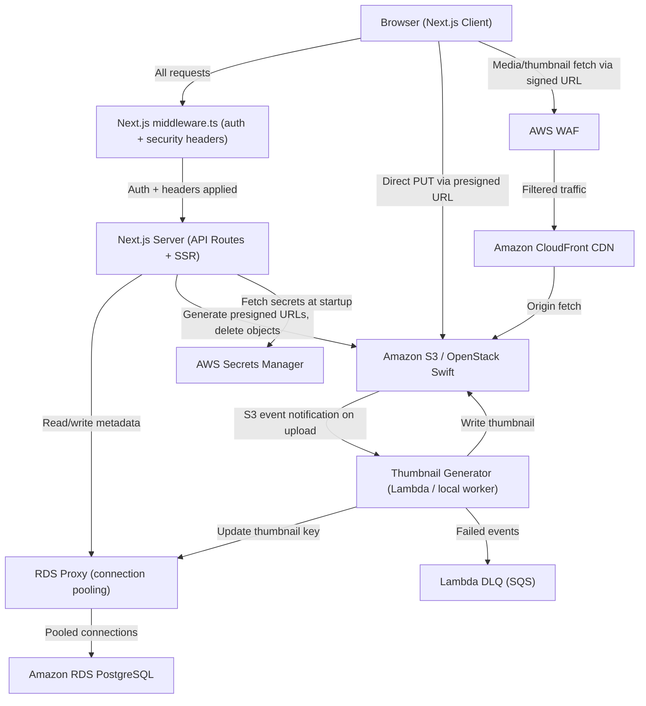

# Design Document: Nestpic App

## Overview

Nestpic is a private, invite-only family photo and video sharing platform built with Next.js (App Router). It allows authenticated family members to upload, browse, organize, and delete media in a closed environment.

The system is deployed on AWS with the following core infrastructure:
- Amazon S3 for media and thumbnail storage
- Amazon RDS (PostgreSQL) for all application metadata
- Amazon CloudFront as the CDN for media delivery
- Next.js API routes for server-side logic
- AWS WAF attached to CloudFront for DDoS and web exploit protection
- RDS Proxy for connection pooling between Lambda/serverless compute and RDS
- AWS Secrets Manager for production secret storage
- Lambda Dead Letter Queue (DLQ) for failed thumbnail generation events
- CloudWatch alarms for Lambda error rate and RDS connection count

Locally, OpenStack Swift replaces S3 as an S3-compatible object store, allowing full development without real AWS credentials.

Key design decisions:
- Presigned S3 PUT URLs for direct client-to-S3 uploads (avoids routing large files through the app server); URLs are constrained with Content-Type and Content-Length to prevent content-type spoofing
- Server-side session management (no client-exposed AWS credentials); session rotation on sign-in prevents session fixation
- Thumbnail generation triggered by S3 event notifications (async, decoupled from upload flow); Lambda has a DLQ for failed events
- Environment-driven storage abstraction so the same codebase runs locally and in production
- Centralized Next.js middleware for auth enforcement and HTTP security headers (CSP, HSTS, X-Frame-Options, X-Content-Type-Options)
- Zod schema validation on all API route inputs for runtime type safety
- RDS Proxy for connection pooling to handle Lambda cold starts
- AWS Secrets Manager for all production secrets (no secrets in env files)
- `server-only` package to prevent accidental client-side imports of server modules
- TypeScript strict mode enabled throughout

---

## Architecture



### Request Flow: Upload

1. Client selects file(s), validates format and size client-side
2. Client calls `POST /api/upload/presign` — server validates session, generates presigned PUT URL (15 min expiry), creates a pending media record in RDS
3. Client uploads file directly to S3 using the presigned URL, reporting progress via XHR
4. Client calls `POST /api/upload/confirm` — server marks media record as active in RDS
5. S3 event triggers Thumbnail Generator; thumbnail is written to S3 and key recorded in RDS

### Request Flow: Media Delivery

1. Client requests a feed or album page
2. Server fetches media metadata from RDS, generates short-lived CloudFront signed URLs (1 hr) for each thumbnail
3. Client renders thumbnails via CDN URLs
4. On media open, server generates a fresh signed URL for the full-resolution file

---

## Components and Interfaces

### Auth Service

Handles session-based authentication and invitation flow.

```
POST /api/auth/signin        — validate credentials, create session cookie (with session rotation)
POST /api/auth/signout       — invalidate session
POST /api/auth/invite        — generate invitation token (authenticated, rate-limited)
POST /api/auth/register      — register via invitation token (rate-limited)
GET  /api/auth/session       — return current session info
```

Session tokens are stored server-side (database or Redis). The session cookie is `HttpOnly`, `Secure`, `SameSite=Lax`. On successful sign-in, the old session is destroyed and a new session ID is issued (session rotation) to prevent session fixation.

All inputs to auth routes are validated with Zod schemas before processing.

### Security Middleware (`middleware.ts`)

A single Next.js `middleware.ts` handles two cross-cutting concerns for all routes:

1. **Authentication enforcement**: checks for a valid session cookie on all protected routes; redirects unauthenticated requests to `/signin`. Replaces per-route auth guards.
2. **HTTP security headers**: injects the following headers on every response:
   - `Content-Security-Policy`: restricts script/style/media sources
   - `Strict-Transport-Security: max-age=63072000; includeSubDomains`
   - `X-Frame-Options: DENY`
   - `X-Content-Type-Options: nosniff`
   - `Referrer-Policy: strict-origin-when-cross-origin`

### Rate Limiter

Applied via middleware or route-level wrappers on sensitive endpoints:
- `POST /api/auth/signin`: max 10 requests per IP per minute → HTTP 429
- `POST /api/auth/invite`: max 5 requests per authenticated user per hour → HTTP 429
- `POST /api/auth/register`: max 5 requests per IP per hour → HTTP 429

### Schema Validator (Zod)

Every API route handler validates its request body/query params against a Zod schema before any business logic runs. Invalid inputs return HTTP 400 with the structured error shape `{ "error": { "code": "VALIDATION_ERROR", "message": string, "fields": ZodIssue[] } }`.

Example schemas live alongside their route handlers in `src/lib/schemas/`.

### Uploader

```
POST /api/upload/presign     — generate presigned S3 PUT URL (with Content-Type + Content-Length constraints)
POST /api/upload/confirm     — confirm upload complete, activate media record
```

Presigned PUT URLs include `ContentType` and `ContentLengthRange` conditions to prevent content-type spoofing. A scheduled cleanup job (cron or Lambda) deletes `pending` media records and their S3 objects older than 1 hour.

### Media Store

```
GET  /api/feed               — paginated feed (30 items/page, reverse chron)
GET  /api/media/:id          — single media item with signed CDN URL
DELETE /api/media/:id        — delete media (owner only)
GET  /api/albums             — list albums for current user's family
POST /api/albums             — create album
GET  /api/albums/:id         — album contents (paginated)
POST /api/albums/:id/media   — add media to album
DELETE /api/albums/:id       — delete album (preserves media)
```

### Object Store Abstraction

A thin adapter layer that exposes a consistent interface regardless of backend (S3 or OpenStack Swift):

```typescript
interface ObjectStore {
  generatePresignedPutUrl(
    key: string,
    contentType: string,
    contentLength: number,
    expiresIn: number
  ): Promise<string>
  generateSignedGetUrl(key: string, expiresIn: number): Promise<string>
  deleteObject(key: string): Promise<void>
  headObject(key: string): Promise<{ contentLength: number; contentType: string }>
}
```

`generatePresignedPutUrl` now accepts `contentLength` so the presigned URL can enforce `ContentLengthRange` conditions. Instantiated at startup based on `NODE_ENV` and environment variables. In production, secrets are fetched from AWS Secrets Manager rather than environment variables.

### Thumbnail Generator

In production: AWS Lambda triggered by S3 `ObjectCreated` events on the originals prefix. The Lambda is configured with a Dead Letter Queue (SQS) so failed events are captured for inspection and retry rather than silently dropped.
Locally: a background worker process that polls for new media records and processes them.

Responsibilities:
- For photos: resize to max 400px on the longest side, output JPEG
- For videos: extract first frame using ffmpeg, resize, output JPEG
- Write thumbnail to `thumbnails/{mediaId}.jpg` in the object store
- Update the `thumbnail_key` column in the `media` table

### API Response Helpers

All API routes use a shared typed response helper to enforce consistent response shapes:

```typescript
// src/lib/api/response.ts
export function ok<T>(data: T): NextResponse
export function err(code: string, message: string, status: number): NextResponse
// Error shape: { "error": { "code": string, "message": string } }
```

Server-only modules (db client, object store, secrets) are marked with `import 'server-only'` to prevent accidental client-side bundling.

---

## Data Models

### users

| Column        | Type         | Notes                                    |
|---------------|--------------|------------------------------------------|
| id            | UUID PK      |                                          |
| name          | VARCHAR(100) | Display name                             |
| email         | VARCHAR(255) | Unique                                   |
| password_hash | VARCHAR(255) | bcrypt salted hash, cost factor ≥ 12     |
| created_at    | TIMESTAMPTZ  |                                          |

### sessions

| Column     | Type        | Notes                          |
|------------|-------------|--------------------------------|
| id         | UUID PK     | Session token                  |
| user_id    | UUID FK     | → users.id                     |
| expires_at | TIMESTAMPTZ | Created_at + 7 days            |
| created_at | TIMESTAMPTZ |                                |

### invitations

| Column     | Type        | Notes                          |
|------------|-------------|--------------------------------|
| id         | UUID PK     | Invitation token               |
| created_by | UUID FK     | → users.id                     |
| used_by    | UUID FK     | → users.id, nullable           |
| expires_at | TIMESTAMPTZ | Created_at + 72 hours          |
| used_at    | TIMESTAMPTZ | Nullable                       |
| created_at | TIMESTAMPTZ |                                |

### media

| Column        | Type         | Notes                                      |
|---------------|--------------|--------------------------------------------|
| id            | UUID PK      |                                            |
| uploader_id   | UUID FK      | → users.id                                 |
| s3_key        | VARCHAR(500) | Object key in S3/Swift                     |
| thumbnail_key | VARCHAR(500) | Nullable until thumbnail is generated      |
| content_type  | VARCHAR(100) | e.g. `image/jpeg`, `video/mp4`             |
| file_size     | BIGINT       | Bytes                                      |
| status        | VARCHAR(20)  | `pending` → `active` (after confirm)       |
| uploaded_at   | TIMESTAMPTZ  |                                            |

### albums

| Column     | Type         | Notes          |
|------------|--------------|----------------|
| id         | UUID PK      |                |
| name       | VARCHAR(100) |                |
| created_by | UUID FK      | → users.id     |
| created_at | TIMESTAMPTZ  |                |

### album_media

| Column   | Type        | Notes              |
|----------|-------------|--------------------|
| album_id | UUID FK     | → albums.id        |
| media_id | UUID FK     | → media.id         |
| added_at | TIMESTAMPTZ |                    |

Primary key: (album_id, media_id)

### rate_limit_buckets

Used by the in-process rate limiter (or a Redis-backed equivalent) to track request counts per key.

| Column      | Type        | Notes                                          |
|-------------|-------------|------------------------------------------------|
| key         | VARCHAR(255)| e.g. `signin:ip:1.2.3.4` or `invite:user:uuid`|
| count       | INTEGER     | Requests in current window                     |
| window_start| TIMESTAMPTZ | Start of the current rate limit window         |

Primary key: (key)


---

## Correctness Properties

*A property is a characteristic or behavior that should hold true across all valid executions of a system — essentially, a formal statement about what the system should do. Properties serve as the bridge between human-readable specifications and machine-verifiable correctness guarantees.*

### Property 1: Unauthenticated requests to protected routes are redirected

*For any* protected route path and any request without a valid session cookie, the server response SHALL be a redirect to the sign-in page (HTTP 302/307).

**Validates: Requirements 1.1**

---

### Property 2: Sign-in / sign-out round trip invalidates session

*For any* valid user, signing in produces a valid session, and subsequently signing out renders that session token invalid — meaning any request using the old token is treated as unauthenticated.

**Validates: Requirements 1.2, 1.4**

---

### Property 3: Invalid credentials never produce a session

*For any* (email, password) pair where the password does not match the stored hash for that email, the sign-in endpoint SHALL return an error and SHALL NOT create a session record in the database.

**Validates: Requirements 1.3**

---

### Property 4: Session expiry is at least 7 days

*For any* newly created session, the `expires_at` timestamp SHALL be at least 7 days after the `created_at` timestamp.

**Validates: Requirements 1.5**

---

### Property 5: File validation rejects invalid inputs

*For any* file whose MIME type is not in {image/jpeg, image/png, image/gif, image/webp, video/mp4, video/quicktime, video/x-msvideo}, OR whose size exceeds 200 MB, the upload validation function SHALL return an error and SHALL NOT proceed to presign URL generation.

**Validates: Requirements 2.1, 2.2, 2.3**

---

### Property 6: Presigned PUT URLs expire within 15 minutes

*For any* presigned PUT URL generated by the server, the expiry encoded in the URL SHALL be no more than 900 seconds (15 minutes) from the time of generation.

**Validates: Requirements 2.6**

---

### Property 7: Upload confirm persists complete metadata

*For any* completed upload, after calling the confirm endpoint the media record in the database SHALL contain the correct s3_key, content_type, file_size, uploader_id, and status = `active`.

**Validates: Requirements 2.7**

---

### Property 8: Thumbnail key uses dedicated prefix and is recorded in DB

*For any* media item processed by the Thumbnail Generator, the resulting `thumbnail_key` SHALL start with the `thumbnails/` prefix, and the `thumbnail_key` column in the `media` table SHALL be updated to that key.

**Validates: Requirements 2.10**

---

### Property 9: Media listings are in reverse chronological order

*For any* feed page or album view containing two or more media items, every item SHALL have an `uploaded_at` value greater than or equal to the `uploaded_at` of the item that follows it in the response.

**Validates: Requirements 3.1, 4.5**

---

### Property 10: Feed and album media items include required fields

*For any* media item returned in a feed or album response, the payload SHALL include `thumbnail_url`, `uploader_name`, and `uploaded_at`.

**Validates: Requirements 3.2**

---

### Property 11: Signed CDN URLs expire within 1 hour

*For any* signed CDN URL generated for a thumbnail or full-resolution media item, the expiry encoded in the URL SHALL be no more than 3600 seconds (1 hour) from the time of generation.

**Validates: Requirements 3.3, 5.1**

---

### Property 12: Feed pagination returns at most 30 items per page

*For any* feed with N > 30 media items, a request for any single page SHALL return exactly 30 items (or fewer for the last page), and the total number of items across all pages SHALL equal N.

**Validates: Requirements 3.4**

---

### Property 13: Album creation persists correct metadata

*For any* valid album name and authenticated user, after creating an album the database record SHALL contain the submitted name, a `created_at` timestamp, and the creating user's id.

**Validates: Requirements 4.1**

---

### Property 14: Album name validation rejects invalid names

*For any* album name that is empty (after trimming) or longer than 100 characters, the create-album endpoint SHALL return a validation error and SHALL NOT persist a record.

**Validates: Requirements 4.2**

---

### Property 15: Media can belong to multiple albums simultaneously

*For any* media item added to N distinct albums, querying each of those N albums SHALL include that media item.

**Validates: Requirements 4.3, 4.4**

---

### Property 16: Album deletion preserves media

*For any* album containing M media items, after deleting the album the album record SHALL not exist in the database, but all M media items SHALL still exist in the database and in the object store.

**Validates: Requirements 4.6**

---

### Property 17: Media deletion removes all traces

*For any* media item owned by the requesting user, after a confirmed deletion: the media record SHALL not exist in the database, the s3_key SHALL not exist in the object store, the thumbnail_key SHALL not exist in the object store, and the media item SHALL not appear in any album or feed query.

**Validates: Requirements 6.2, 6.4**

---

### Property 18: Non-owner cannot delete media

*For any* media item and any authenticated user who is not the uploader, the delete endpoint SHALL return a permission error (HTTP 403) and SHALL NOT modify the media record or object store.

**Validates: Requirements 6.3**

---

### Property 19: Invitation tokens are unique and expire in 72 hours

*For any* N invitations generated, all N tokens SHALL be distinct, and each token's `expires_at` SHALL be exactly 72 hours after its `created_at`.

**Validates: Requirements 7.1**

---

### Property 20: Invitation token is invalidated after successful registration

*For any* valid invitation token used to register a new user, after registration the token SHALL be marked as used (non-null `used_at`, non-null `used_by`) and SHALL be rejected if presented again.

**Validates: Requirements 7.3**

---

### Property 21: Expired or used invitation tokens are rejected

*For any* invitation token whose `expires_at` is in the past or whose `used_at` is non-null, the registration endpoint SHALL return an error and SHALL NOT create a user account.

**Validates: Requirements 7.4**

---

### Property 22: Short passwords are rejected at registration

*For any* password string with fewer than 8 characters, the registration endpoint SHALL return a validation error and SHALL NOT create a user account.

**Validates: Requirements 7.5**

---

### Property 23: Passwords are stored as hashes, never plaintext

*For any* registered user, the `password_hash` value stored in the database SHALL NOT equal the plaintext password submitted during registration, and SHALL be verifiable using bcrypt comparison.

**Validates: Requirements 7.6**

---

### Property 24: Signed URLs are scoped to a specific object key

*For any* generated presigned PUT URL or signed CDN GET URL, the URL SHALL contain the exact S3 object key it was generated for and SHALL NOT grant access to any other key.

**Validates: Requirements 9.6**

---

### Property 25: Object store is configured from environment variables

*For any* set of valid environment variable values (endpoint, access key, secret key), the ObjectStore factory SHALL produce an instance configured with exactly those values and no hardcoded fallbacks.

**Validates: Requirements 10.7**

---

### Property 26: Missing environment variables prevent startup

*For any* missing required object store environment variable, the application startup validation SHALL throw a descriptive error and SHALL NOT initialize the ObjectStore or start the server.

**Validates: Requirements 10.8**

---

### Property 27: E2E authentication workflow completes successfully

*For any* running instance of the system with a seeded Test_User, a browser session that signs in with valid credentials SHALL land on the Feed, a subsequent sign-out SHALL redirect to the sign-in page, and navigating to a protected route without a session SHALL redirect to the sign-in page.

**Validates: Requirements 11.2**

---

### Property 28: E2E upload workflow surfaces media in the feed

*For any* running instance of the system with a signed-in Test_User, selecting a supported file and completing the upload flow SHALL result in the uploaded media item appearing in the Feed, and upload progress SHALL be visible to the user during the transfer.

**Validates: Requirements 11.3**

---

### Property 29: E2E feed workflow supports browsing, pagination, and media opening

*For any* running instance of the system with a signed-in Test_User and at least one page of media, the Feed SHALL display media items with thumbnails, uploader names, and upload dates; scrolling to the bottom SHALL load the next page without a full page reload; and selecting a media item SHALL open it in the lightbox or video player.

**Validates: Requirements 11.4**

---

### Property 30: E2E album management workflow covers full CRUD lifecycle

*For any* running instance of the system with a signed-in Test_User, creating an album with a valid name SHALL make it appear in the albums list; adding a media item to that album SHALL make it visible in the album view in reverse chronological order; and deleting the album SHALL remove it from the albums list.

**Validates: Requirements 11.5**

---

### Property 31: E2E media viewing workflow supports lightbox navigation and video playback

*For any* running instance of the system with a signed-in Test_User and at least two media items in the Feed, opening a photo SHALL display it in the lightbox overlay; the previous and next navigation controls SHALL move between media items; and opening a video SHALL present a player whose play and pause controls are interactive.

**Validates: Requirements 11.6**

---

### Property 32: E2E deletion workflow removes media from the feed

*For any* running instance of the system with a signed-in Test_User who owns at least one media item, confirming the deletion prompt for that item SHALL result in the item no longer appearing in the Feed.

**Validates: Requirements 11.7**

---

### Property 33: E2E invitation workflow allows a guest to register

*For any* running instance of the system with a signed-in Test_User, generating an invitation link and following that link as a guest SHALL present a registration form, and submitting valid registration details SHALL create a new account and sign the new user in.

**Validates: Requirements 11.8**

---

### Property 34: Sign-in session rotation issues a new session ID

*For any* user who has an existing session and signs in again, the session ID after sign-in SHALL differ from the session ID before sign-in, and the old session ID SHALL be invalid.

**Validates: Requirements 1.7**

---

### Property 35: Rate limiting rejects excess requests

*For any* IP address that exceeds the configured request threshold for a rate-limited endpoint within the time window, subsequent requests SHALL receive HTTP 429 with a `Retry-After` header, and SHALL NOT be processed.

**Validates: Requirements 1.8, 1.9, 7.9**

---

### Property 36: Presigned PUT URLs enforce Content-Type and Content-Length

*For any* presigned PUT URL generated by the server, the URL conditions SHALL include the declared Content-Type and a Content-Length range matching the declared file size, such that a PUT request with a different Content-Type or a body exceeding the declared size is rejected by S3.

**Validates: Requirements 2.12**

---

### Property 37: Stale pending media records are cleaned up

*For any* media record with status `pending` and `created_at` older than 1 hour, after the cleanup job runs the record SHALL not exist in the database and its associated S3 object SHALL not exist in the object store.

**Validates: Requirements 2.13**

---

### Property 38: bcrypt cost factor is at least 12

*For any* password hash stored in the database, extracting the cost factor from the bcrypt hash string SHALL yield a value of at least 12.

**Validates: Requirements 7.7**

---

### Property 39: Invitation token comparison is constant-time

*For any* two invitation token strings of equal length, the time taken to compare a valid token against an invalid token SHALL not differ significantly from comparing two invalid tokens (i.e., the comparison does not short-circuit on the first differing byte).

**Validates: Requirements 7.8**

---

### Property 40: Security headers are present on all responses

*For any* HTTP response from the server, the response SHALL include `X-Frame-Options`, `X-Content-Type-Options`, `Strict-Transport-Security`, and a `Content-Security-Policy` header.

**Validates: Requirements 12.1**

---

### Property 41: Zod validation rejects malformed API inputs

*For any* API route and any request body that does not conform to the route's Zod schema, the route SHALL return HTTP 400 with a structured validation error and SHALL NOT execute any business logic.

**Validates: Requirements 12.3**

---

## Error Handling

### Authentication Errors
- Invalid credentials: HTTP 401 with a generic "Invalid email or password" message (no enumeration of which field is wrong)
- Missing/expired session: HTTP 401, redirect to sign-in for browser requests
- Insufficient permissions (e.g. deleting another user's media): HTTP 403
- Rate limit exceeded: HTTP 429 with `Retry-After` header indicating when the window resets

### Input Validation Errors
- Zod schema mismatch on any API route: HTTP 400 with `{ "error": { "code": "VALIDATION_ERROR", "message": string, "fields": ZodIssue[] } }`
- CSRF token missing or invalid on state-mutating routes: HTTP 403 with `{ "error": { "code": "CSRF_INVALID" } }`

### Upload Errors
- Unsupported file type: HTTP 400 with specific format error before presign is requested
- File too large: HTTP 400 with size limit message before presign is requested
- Presign failure (S3 unreachable): HTTP 502, user sees "Upload service unavailable"
- Confirm called for unknown/already-active media: HTTP 404 / HTTP 409

### Invitation Errors
- Expired token: HTTP 410 Gone with "This invitation has expired"
- Already-used token: HTTP 410 Gone with "This invitation has already been used"
- Invalid token format: HTTP 400

### Album Errors
- Empty or too-long name: HTTP 400 with field-level validation message
- Album not found: HTTP 404
- Adding media that doesn't exist: HTTP 404

### Infrastructure Errors
- Database connection failure: HTTP 503, logged server-side with full error, client sees generic "Service unavailable"
- Object store unreachable: HTTP 502, same pattern
- Missing env vars at startup: process exits with non-zero code and descriptive log message

### General Principles
- Never expose internal stack traces or database error details to the client
- Log all 5xx errors server-side with request ID for traceability
- Use consistent JSON error shape: `{ "error": { "code": string, "message": string } }`

---

## Testing Strategy

### Dual Testing Approach

Both unit tests and property-based tests are required. They are complementary:
- Unit tests catch concrete bugs at specific inputs and integration points
- Property-based tests verify universal correctness across the full input space

### Unit Tests

Focus on:
- Specific examples: sign-in with known credentials, create album with known name
- Integration points: API route handlers with mocked DB and object store
- Edge cases: empty album name, exactly 200 MB file, token expiring in 1 second
- Error conditions: DB throws, S3 unreachable, missing env vars

Avoid writing unit tests for every input variation — property tests handle that.

### Property-Based Tests

Use [fast-check](https://github.com/dubzzz/fast-check) (TypeScript/JavaScript PBT library).

Each property test must:
- Run a minimum of **100 iterations**
- Be tagged with a comment referencing the design property it validates
- Tag format: `// Feature: nestpic-app, Property {N}: {property_text}`

Properties 1–26 MUST each be implemented by exactly one property-based test (via fast-check). Properties 27–33 are E2E workflow examples implemented as Playwright tests (see the Playwright E2E Tests section below).

Example structure:

```typescript
// Feature: nestpic-app, Property 5: File validation rejects invalid inputs
it('rejects files with unsupported MIME types', () => {
  fc.assert(
    fc.property(
      fc.record({
        mimeType: fc.string().filter(s => !ACCEPTED_TYPES.includes(s)),
        size: fc.integer({ min: 1, max: MAX_FILE_SIZE }),
      }),
      ({ mimeType, size }) => {
        const result = validateFile({ mimeType, size })
        expect(result.ok).toBe(false)
        expect(result.error.code).toBe('UNSUPPORTED_FORMAT')
      }
    ),
    { numRuns: 100 }
  )
})
```

### Test Organization

```
src/
  __tests__/
    unit/
      auth.test.ts          — sign-in, sign-out, session expiry examples
      upload.test.ts        — presign, confirm, file validation examples
      albums.test.ts        — CRUD examples and edge cases
      objectStore.test.ts   — adapter interface examples
      middleware.test.ts    — security headers, auth redirect, rate limiting
      schemas.test.ts       — Zod schema validation examples
    property/
      auth.property.ts      — Properties 1–4, 22–23
      upload.property.ts    — Properties 5–8
      feed.property.ts      — Properties 9–12
      albums.property.ts    — Properties 13–16
      media.property.ts     — Properties 17–18
      invitations.property.ts — Properties 19–21
      urls.property.ts      — Properties 11, 24
      config.property.ts    — Properties 25–26
```

### Test Environment

- Unit and property tests run against an in-memory SQLite database (via `pg-mem`) and a mock ObjectStore
- No real AWS credentials or OpenStack instance required for tests
- CI runs all tests with `vitest --run`

### Local Development Stack

The full local stack is defined in `docker-compose.yml` and includes:
- **postgres**: PostgreSQL 15, exposed on `localhost:5432`, with a health check
- **swift**: OpenStack Swift (`fnndsc/swift` or equivalent), exposed on `localhost:8080`, S3-compatible API
- **thumbnail-worker** (optional): local thumbnail worker process

A separate `docker-compose.test.yml` provides an isolated stack for E2E tests with its own PostgreSQL and Swift instances on different ports, preventing test runs from polluting the dev database.

Common developer tasks are available via `package.json` scripts (or a `Makefile`):
```
npm run dev          — start Next.js dev server
npm run db:migrate   — run SQL migrations
npm run db:seed      — seed test data
npm run test         — run vitest unit + property tests
npm run test:e2e     — run Playwright E2E suite
```

A `.env.example` file is committed to the repository with all required variable names and placeholder values. Real secrets are never committed.

### Playwright E2E Tests

E2E tests exercise complete user workflows through a real browser against a fully running local stack.

#### Test Setup

- Framework: [Playwright](https://playwright.dev/) with the `@playwright/test` runner
- Target: locally running Next.js dev server (`http://localhost:3000`)
- Object store: OpenStack Swift instance started via Docker Compose (same as `Local_Dev_Environment`)
- Database: local PostgreSQL instance (same as `Local_Dev_Environment`)
- Test user seeding: a `scripts/seed-test-users.ts` setup script runs before the suite, inserting known `Test_User` credentials into the database so tests have a stable sign-in identity
- Playwright config (`playwright.config.ts`) sets `globalSetup` to the seed script and configures `baseURL`, screenshot-on-failure, and trace-on-failure

#### Page Object Model (POM)

All E2E tests use the Page Object Model pattern. Each page or major component has a corresponding Page Object class in `e2e/pages/` that encapsulates selectors and interactions:

```typescript
// e2e/pages/SignInPage.ts
export class SignInPage {
  constructor(private page: Page) {}
  async signIn(email: string, password: string) { ... }
  async getErrorMessage() { ... }
}
```

This keeps test files focused on workflow assertions rather than selector details, and makes selector updates a single-file change.

#### Auth State Reuse

Tests within a file that require an authenticated user use `test.use({ storageState: 'e2e/.auth/user.json' })` to load a pre-saved browser auth state, avoiding a full sign-in sequence in every test case. The auth state is saved once in `globalSetup` after seeding the test user.

#### CI Configuration

In CI, Playwright runs with `--reporter=html` to produce a human-readable HTML report retained as a build artifact. The `playwright.config.ts` `webServer` entry starts the Next.js server automatically before the suite.

#### Test Isolation

Each E2E test file uses an isolated Test_User (seeded per-file) or cleans up created data in an `afterEach`/`afterAll` hook to prevent cross-test contamination.

#### Failure Artifacts

When any E2E test step fails, Playwright automatically captures:
- A **screenshot** of the browser at the point of failure
- A **Playwright trace** (`.zip`) containing a full timeline of network requests, DOM snapshots, and console output

Artifacts are written to `test-results/` and are retained in CI as build artifacts.

#### Test Organization

```
e2e/
  pages/
    SignInPage.ts         — POM for sign-in page
    FeedPage.ts           — POM for feed page
    AlbumsPage.ts         — POM for albums list/detail
    UploadModal.ts        — POM for upload modal
    Lightbox.ts           — POM for lightbox overlay
    InvitePage.ts         — POM for invitation/registration
  auth.e2e.ts           — Property 27: sign-in, sign-out, protected route redirect
  upload.e2e.ts         — Property 28: file selection, progress display, feed appearance
  feed.e2e.ts           — Property 29: browsing, pagination, media opening
  albums.e2e.ts         — Property 30: create, add media, view, delete album
  media-viewing.e2e.ts  — Property 31: lightbox, prev/next navigation, video player
  deletion.e2e.ts       — Property 32: deletion confirmation, feed removal
  invitations.e2e.ts    — Property 33: generate invite link, guest registration
  .auth/
    user.json           — saved auth state for storageState reuse
playwright.config.ts
scripts/
  seed-test-users.ts    — inserts Test_User accounts before the suite runs
```

One file per workflow keeps failures easy to isolate and re-run.

#### Running E2E Tests

```bash
npx playwright test
# CI:
npx playwright test --reporter=html
```

The suite exits with a non-zero code if any test fails, making it suitable for CI gating. To run a single workflow file:

```bash
npx playwright test e2e/auth.e2e.ts
```

Each test file references the design property it validates with a comment at the top:

```typescript
// Feature: nestpic-app, Property 27: E2E authentication workflow completes successfully
```
