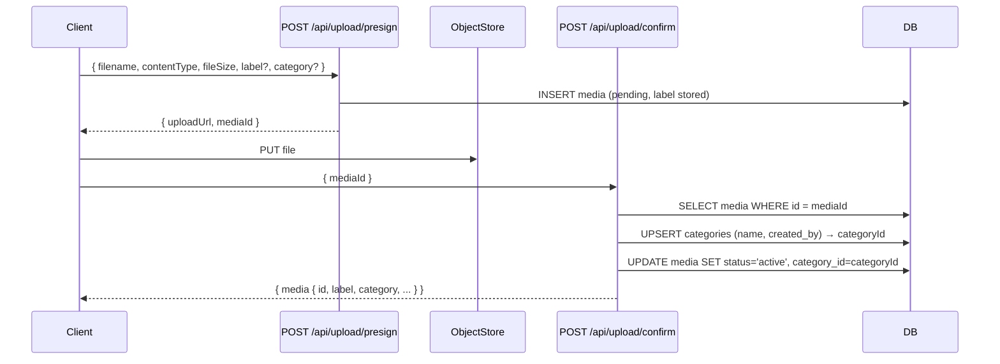

# Design Document: Upload Labels & Categories

## Overview

This feature extends NestPic's upload flow to support per-media labels and category groupings. A **label** is a short free-text description attached to a single media item (e.g. "Beach sunset"). A **category** is a named group that organises multiple media items per uploader (e.g. "Holidays").

The existing three-step upload flow (presign → object-store PUT → confirm) is extended to carry label and category metadata. The confirm step resolves the category (creating it if needed) and persists both fields to the `media` row. A new `GET /api/categories` and `GET /api/categories/[id]/media` API enables category browsing. The feed and album views are updated to surface label and category on every media item.

## Architecture

The change touches four layers:

1. **Database** – new `categories` table; `label` and `category_id` columns on `media`.
2. **API** – extended presign/confirm schemas and routes; two new category routes.
3. **UI** – `UploadForm` gains a label text input and a category selector/creator.
4. **Tests** – updated property tests and E2E tests.



## Components and Interfaces

### Database migration (`migrations/003_labels_categories.sql`)

Adds:
- `categories` table
- `label VARCHAR(100)` column on `media`
- `category_id UUID` FK column on `media`
- Unique constraint and indexes

The migration is picked up automatically at application boot. `src/lib/migrations.ts` scans the `migrations/` directory for `.sql` files sorted alphabetically, skipping any already recorded in the `_migrations` table. `src/instrumentation.ts` calls `runMigrations()` once on server startup (Node.js runtime only). No additional wiring is required — placing `003_labels_categories.sql` in the `migrations/` directory is sufficient.

### Schema updates (`src/lib/schemas/upload.ts`)

`presignSchema` gains optional `label` (string ≤ 100) and `category` (string ≤ 100).  
`confirmSchema` gains the same optional fields (passed through from the client so the confirm route can resolve the category).

### Presign route (`src/app/api/upload/presign/route.ts`)

Accepts and validates the new fields. Stores `label` in the pending `media` row (category is resolved at confirm time, not presign time, since the category ID is not yet known).

### Confirm route (`src/app/api/upload/confirm/route.ts`)

After activating the media record:
1. If `category` name is provided, `INSERT INTO categories … ON CONFLICT (name, created_by) DO NOTHING` then `SELECT id`.
2. `UPDATE media SET status='active', category_id=$categoryId WHERE id=$mediaId`.
3. Returns the full media object including `label` and `category` name.

### Categories API

- `GET /api/categories` – returns all categories for the authenticated user.
- `GET /api/categories/[id]/media` – returns paginated media (≤ 30 items, cursor-based) for a category, ordered by `uploaded_at DESC`. Each item includes `label`, `category`, `thumbnailUrl`, `uploaderName`, `uploadedAt`.

### UploadForm component (`src/components/UploadForm.tsx`)

- Adds a `<input type="text" maxLength={100}>` for label.
- Adds a `<select>` populated from `GET /api/categories` plus a "New category…" option that reveals a text input.
- Passes `label` and `category` in the presign request body.
- Client-side validation: label > 100 chars → error; category name > 100 chars → error.

### Type updates (`src/lib/types/media.ts`)

`FeedItem` gains optional `label: string | null` and `category: string | null`.

## Data Models

### `categories` table

```sql
CREATE TABLE categories (
  id         UUID PRIMARY KEY DEFAULT gen_random_uuid(),
  name       VARCHAR(100) NOT NULL,
  created_by UUID NOT NULL REFERENCES users(id) ON DELETE CASCADE,
  created_at TIMESTAMPTZ NOT NULL DEFAULT now(),
  CONSTRAINT categories_name_owner_unique UNIQUE (name, created_by)
);
```

### `media` table additions

```sql
ALTER TABLE media
  ADD COLUMN label       VARCHAR(100),
  ADD COLUMN category_id UUID REFERENCES categories(id) ON DELETE SET NULL;
```

### Indexes

```sql
CREATE INDEX idx_categories_created_by      ON categories(created_by);
CREATE INDEX idx_media_category_id          ON media(category_id);
CREATE INDEX idx_media_category_uploaded_at ON media(category_id, uploaded_at DESC);
```

### Updated `FeedItem` TypeScript type

```typescript
export interface FeedItem {
  id: string;
  thumbnailUrl: string | null;
  uploaderName: string;
  uploaderId: string;
  uploadedAt: string;
  contentType: string;
  s3Key: string;
  label: string | null;       // new
  category: string | null;    // new
}
```

### Category API response shape

```typescript
interface Category {
  id: string;
  name: string;
  createdBy: string;
  createdAt: string;
}

interface CategoryMediaItem extends FeedItem {
  label: string | null;
  category: string | null;
}
```


## Correctness Properties

*A property is a characteristic or behavior that should hold true across all valid executions of a system — essentially, a formal statement about what the system should do. Properties serve as the bridge between human-readable specifications and machine-verifiable correctness guarantees.*

### Property 1: Field length validation

*For any* label or category string whose length exceeds 100 characters, the presign API SHALL return a 400 validation error and the media record SHALL NOT be created.

**Validates: Requirements 1.3, 2.3, 6.3, 6.4**

### Property 2: Presign accepts valid label and category

*For any* label string of length 0–100 and category string of length 0–100 (including absent/undefined), the presign API SHALL return a 200 response and create a pending media record.

**Validates: Requirements 1.4, 2.5**

### Property 3: Label round-trip

*For any* valid label string (length 0–100), after the confirm step the label stored in the database and returned in the response SHALL equal the label that was submitted at presign time.

**Validates: Requirements 1.5, 7.7**

### Property 4: Category creation idempotency

*For any* uploader and category name, confirming two uploads with the same category name SHALL result in exactly one `categories` row for that (name, created_by) pair — the second confirm reuses the existing record.

**Validates: Requirements 2.10, 7.3**

### Property 5: Confirm links media to category

*For any* upload confirmed with a category name, the resulting media row's `category_id` SHALL reference the resolved category record, and the category's `created_by` SHALL equal the uploader's user ID.

**Validates: Requirements 2.6, 2.7**

### Property 6: Category view ordering invariant

*For any* category containing multiple media items with distinct `uploaded_at` timestamps, the `GET /api/categories/[id]/media` endpoint SHALL return items ordered strictly by `uploaded_at` descending (newest first).

**Validates: Requirements 3.3, 7.4**

### Property 7: Category view pagination

*For any* category containing more than 30 media items, the `GET /api/categories/[id]/media` endpoint SHALL return at most 30 items per page and SHALL include a non-null `nextCursor` value.

**Validates: Requirements 3.4**

### Property 8: Response shape includes label and category

*For any* media item returned by the category view, feed, or album view, the response object SHALL include both a `label` field (string or null) and a `category` field (string or null).

**Validates: Requirements 3.5, 4.1, 4.2, 4.3, 4.4**

### Property 9: Category view 404 for unknown ID

*For any* category ID that does not exist in the database, a request to `GET /api/categories/[id]/media` SHALL return a 404 Not Found response.

**Validates: Requirements 3.7**

## Error Handling

| Scenario | HTTP Status | Error Code |
|---|---|---|
| Unauthenticated request to any protected route | 401 | `UNAUTHORIZED` |
| Label or category exceeds 100 characters | 400 | `VALIDATION_ERROR` |
| `mediaId` not a valid UUID in confirm | 400 | `VALIDATION_ERROR` |
| Media record not found at confirm time | 404 | `NOT_FOUND` |
| Media already confirmed (status = active) | 409 | `ALREADY_ACTIVE` |
| Category ID not found | 404 | `NOT_FOUND` |
| Invalid cursor format in category pagination | 400 | `VALIDATION_ERROR` |

Category creation uses `INSERT … ON CONFLICT (name, created_by) DO NOTHING` followed by a `SELECT`, so duplicate category names are handled atomically without application-level race conditions.

## Testing Strategy

### Unit / property tests (`src/__tests__/property/`)

New file: `src/__tests__/property/upload-labels-categories.property.ts`

Uses **fast-check** (already in the project) with a minimum of 100 iterations per property test.

Each test is tagged with a comment in the format:
`// Feature: upload-labels-categories, Property N: <property text>`

| Test | Property | fast-check approach |
|---|---|---|
| Rejects label/category > 100 chars | P1 | Generate strings of length 101–200, call presign route, assert 400 |
| Accepts valid label and category | P2 | Generate strings of length 0–100, call presign route, assert 200 |
| Label round-trip | P3 | Generate valid label, presign + confirm, assert stored label equals input |
| Category idempotency | P4 | Same category name, two confirms for same uploader, assert one DB row |
| Confirm links media to category | P5 | Confirm with category, assert media.category_id = resolved category.id |
| Category view ordering | P6 | Generate N media with random timestamps, assert response is sorted DESC |
| Category view pagination | P7 | Generate > 30 media rows, assert page ≤ 30 and nextCursor present |
| Response shape | P8 | Generate media with/without label and category, assert fields present |
| 404 for unknown category | P9 | Generate random UUID not in DB, assert 404 |

### E2E tests (`e2e/`)

Update `e2e/upload.e2e.ts`:
- Fill in a label and select/create a category before clicking Upload.
- Assert the confirmed media response includes the submitted label and category.

New test in `e2e/upload.e2e.ts` (or a dedicated `e2e/categories.e2e.ts`):
- Upload media with a category.
- Navigate to `GET /api/categories` and find the created category.
- Navigate to the category view and assert the uploaded media appears there.

### Unit tests (specific examples and edge cases)

- Empty label (omitted) → presign and confirm succeed, `label` is null in response.
- Empty category (omitted) → confirm succeeds, `category_id` is null on media row.
- Unauthenticated request to `GET /api/categories` → 401.
- Unauthenticated request to `GET /api/categories/[id]/media` → 401.
- Request for non-existent category ID → 404.
- Media item with null label returns `label: null` in feed response.
- Media item with null category returns `category: null` in feed response.
